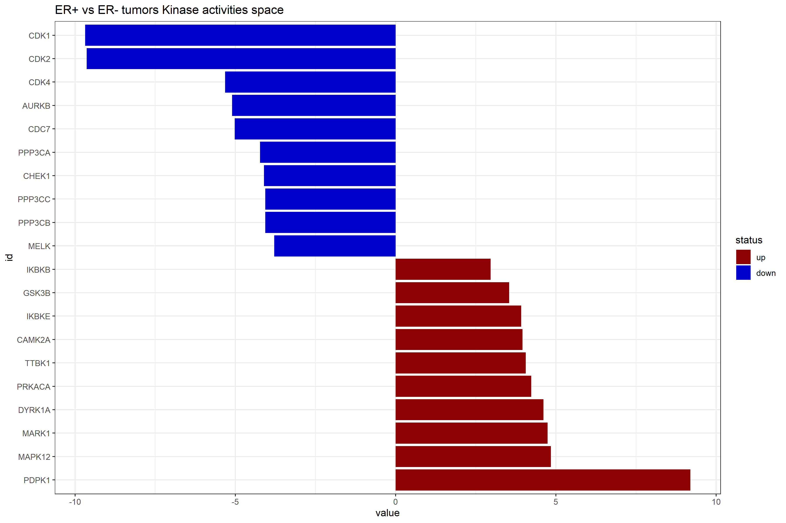

# Biological knowledge extration from phosphoproteomics data based on public repositories

#### NOTE: *Core* parts of this tutorial are also part of the broader DKFZ-B050 lab project related to "*Subclonal drivers of endocrine therapy resistance*"

#### Efstathios-Iason Vlachavas
###### DKFZ-Division of Molecular Genome Analysis (B050)
###### Efstathios-Iason.Vlachavas@dkfz-heidelberg.de

Relative public dataset: brca_broad_2020

Publication: Krug et al. 2020 Cell. {https://www.cell.com/cell/fulltext/S0092-8674(20)31400-8}

Data were downloaded from the open-source resource cBioPortal web portal (https://www.cbioportal.org/)
and the respective files were utilized (https://bit.ly/3e5WxQF):

- File 1: **data_phosphoprotein_quantification.txt** which then saved as an .RData file for downstream analysis

- File 2: **data_clinical_patient.txt** 

- LinkedOmics: http://linkedomics.org/data_download/CPTAC-BRCA/ (alternative resource of the data with more options for available data layers)

## Description

The major goal of this tutorial is to provide a robust and streamline workflow how to analyze cancer phosphoproteomics data from publicly available genomic repositories. The ultimate goal, is based on prior knowledge databases, to infer kinase and pathway activities based on the perturbed phenotypes, and provide putative downstream targets for experimental validation.
In parallel, the relative activities can be utilized as a prioritization tool for possible mechanisms and molecular players responsible for the biological phenomenon under study.

Moreover, various parts of the workflow can be customized or utilized separately in further steps or broader pipelines;

Ultimately, the activity score for each entity is essentially approximated by weighting the molecular readouts of its targets by their **mode of regulation** (*Activating or Inhibiting*) & **likelihood**.


Overall, this tutorial was inspired on the core concepts shared: https://saezlab.github.io/kinase_tf_mini_tuto/
and the relative github repo: https://github.com/saezlab/kinase_tf_mini_tuto_simple based on the R packages decoupleR and OmnipathR.

Further details on each of the utilized databases/tools/repositories based on their respective publications:

- Omnipath: https://doi.org/10.15252/msb.20209923

- PTMSigDB: https://doi.org/10.1074/mcp.TIR118.000943

- decoupleR: https://doi.org/10.1093/bioadv/vbac016

- cBioPortal: https://doi.org/10.1158/2159-8290.CD-12-0095

## Notes on data acquisition and cohort definition

Metadata utilization
- Clinical data was directly utilized from the cBioPortal web page: Two patients for whom no information about the ER status was present were removed. Here the information in the column with the header "ER Updated Clinical Status" is the major biological covariate we are interested in the comparison of ER-negative vs ER-positive patients. The relative file that will be used is **220531_brca_cptac_2020_clinical_data_ER_NA_removed.tsv**.

Phosphoproteome data
- The analysis starts essentially with the normalized log2 abundance ratios
- Further methodological details on the analysis are included in the .Rmd file

## Important R packages that need to be installed for reproducing the analysis

```r

packages = c(
    "tidyverse",
    "decoupleR",
    "readr",
    "OmnipathR",
    "limma",
    "org.Hs.eg.db",
    "ggplot2",
    "forcats"
)

if(!requireNamespace("BiocManager")) {
    install.packages("BiocManager")
}

library(BiocManager)

for(p in packages) {
    if(!requireNamespace(p)) {
        install(p)
    }
}

```
## Implementation

- The user just needs to download/clone the respective github repository ;
- For example git clone https://github.com/Jasonmbg/PublicData.CPTAC.BreastCancer.PhosphoP.git

## Kinase activities visualization



#### At a first glance, we can see that amongst the top hits, kinases such as CDK1, CDK2, CDK4 & AURKB are less activated in the ER+ in comparison to ER- tumors; on this premise, we could speculate that ER- are more proliferative than ER+ tumors.

## Pathway/Disease activities visualization


#### Here, PI3K-Akt is present amongst the top-ranked pathways, based on the combined score value (-> based on different metrics different pathways/Diseases could be prioritized, such as the breast cancer & androgen receptor pathway if we use solely the score value).

## Session Info 

```r
sessionInfo()
R version 4.1.0 (2021-05-18)
Platform: x86_64-w64-mingw32/x64 (64-bit)
Running under: Windows 10 x64 (build 19044)

Matrix products: default

locale:
[1] LC_COLLATE=English_United States.1252  LC_CTYPE=English_United States.1252   
[3] LC_MONETARY=English_United States.1252 LC_NUMERIC=C                          
[5] LC_TIME=English_United States.1252    

attached base packages:
[1] stats4    stats     graphics  grDevices utils     datasets  methods   base     

other attached packages:
 [1] org.Hs.eg.db_3.14.0  AnnotationDbi_1.56.2 IRanges_2.28.0       S4Vectors_0.32.4    
 [5] Biobase_2.54.0       BiocGenerics_0.40.0  OmnipathR_3.2.8      decoupleR_2.1.6     
 [9] limma_3.50.3         forcats_0.5.1        stringr_1.4.0        dplyr_1.0.9         
[13] purrr_0.3.4          readr_2.1.2          tidyr_1.2.0          tibble_3.1.6        
[17] ggplot2_3.3.6        tidyverse_1.3.1       

```

## Acknowledgements

Aurelien Dugourd

DR Mani

Lukas Beumers

Constantinos Yeles
